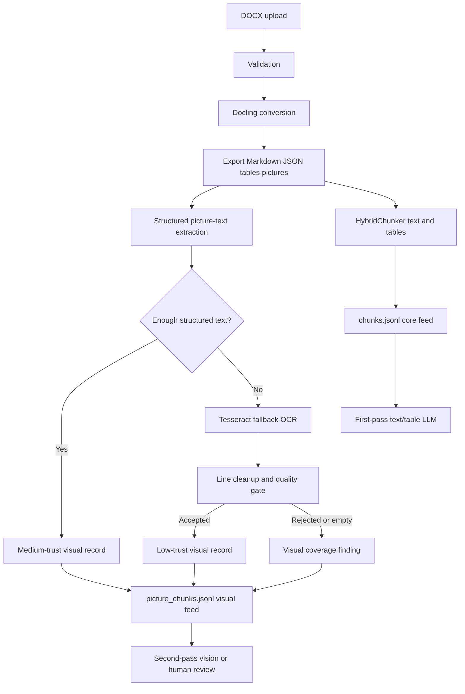

# DOCX Parsing Hardening and Second-Pass LLM Design

## Scope

This report documents the Docling parsing-strengthening work currently implemented in the Decidian Docling Lab. It is grounded in the code under `src/decidian_docling/` and the observed earlier parse of `QAssure_SDD_v1.docx`.

The application is a local evaluation harness. It does not itself call an LLM, create embeddings, or write to a vector database. The artifacts described here are deliberately structured so that a later ingestion service can use reliable text/table content first and route visual material to a separate review pass.

## Why these changes were needed

The earlier DOCX parse completed successfully, but exposed three issues:

| Observation | Risk | Strengthening implemented |
| --- | --- | --- |
| UI displayed `Pages: 0` | It incorrectly implied a zero-page document or failed conversion. | Show `Pages: Unavailable` when DOCX page provenance is absent. |
| Some diagram OCR was obvious noise | Useless strings could become Markdown content and retrieval hits. | Apply a stronger OCR quality gate before accepting/injecting text. |
| Picture OCR and core chunks were combined | Weak diagram evidence could hold back otherwise sound text/table content. | Split core and visual artifacts, integrity reports, readiness, and UI views. |

Existing ZIP output is not modified retroactively. Reparse a DOCX to obtain these new results.

## End-to-end design



The split is physical: the normal core artifact does not include picture supplement chunks.

## 1. DOCX page provenance and UI metric

Docling’s converted DOCX structure can contain headings, elements, tables, and pictures without carrying page-level provenance. That is not equivalent to a document having zero pages.

Each serialized chunk has a `provenance_scope`:

| Scope | Meaning |
| --- | --- |
| `page` | At least one source item carried a Docling page number. |
| `section_only` | No page number, but heading/source structure exists. |
| `unavailable` | No usable page or section provenance was found. |

The parser derives the manifest-level provenance scope from its core chunks. `ui._page_metric()` displays **Unavailable** when both of the following are true:

1. source extension is `.docx`;
2. the recorded page count is absent/zero.

Section-level provenance may still be available, but it is not page provenance. The UI provides the explanatory tooltip: “DOCX page provenance is unavailable in this conversion.” PDFs and any parse with real page provenance retain their numeric page metrics.

This avoids a false `0` while retaining source references and section headings for downstream grounding.

## 2. Picture extraction and stronger OCR filtering

### Structured-first extraction

Picture text extraction remains conservative and uses this order:

1. Export image assets and inspect Docling `document.json`.
2. Prefer text child items already associated with a picture by Docling.
3. Treat that text as sufficient when it has at least 40 characters, four items, or a `section_header`/`code` item. Accepted structured text is labelled `source: docling_structured`, `trust: medium`.
4. Use local Tesseract only as a fallback when structured coverage is insufficient.
5. Label accepted fallback text `source: tesseract_ocr`, `trust: low`.

Tesseract remains supporting visual evidence. It does not replace verified text/table content.

### Line filter

`_clean_ocr_text()` first normalizes whitespace, then retains only lines accepted by `_is_useful_ocr_line()`.

It drops lines that are too short, have no alphanumeric character, are common two-character border/icon fragments such as `an` or `oo`, or consist only of known OCR-residue words. The residue set includes observed noisy outputs such as `aay`, `aoe`, `caan`, `eee`, `ieee`, and `saag`.

Uppercase abbreviations such as `AI`, `IO`, and `QA` remain valid when they occur with descriptive words. The code does not attempt to “correct” OCR or invent text.

### Whole-result quality gate

After cleaning, `_has_useful_ocr_text()` accepts a Tesseract result only if it meets all conditions below.

| Rule | Purpose |
| --- | --- |
| At least 12 non-space characters | Reject a lone tiny diagram label. |
| At least two tokens of length 3+ | Require descriptive content. |
| At least one term of length 5+ | Require a descriptive anchor and reject short-word OCR soup. |
| Short tokens no more than 1.5× substantial tokens | Reject acronym/symbol-heavy noise. |

If the cleaned result is empty, no picture-text record is emitted. If it contains text but fails the gate, the parser records a warning such as:

```text
Picture OCR rejected for picture-0001.png: low-quality text
```

The rejected string is not injected into `document.md`, not written to `picture_text.jsonl`, and not included in any chunk feed.

### Auditability after rejection

Rejecting OCR does not erase the fact that a qualifying image existed. Coverage records mark it as `ocr_low_quality`; this creates a visual integrity finding. Other outcomes distinguish structured recovery, accepted OCR, empty OCR, timeout, and OCR failure. The original asset is retained for later review.

## 3. Separate core and visual outputs

| Artifact | Content | Intended use |
| --- | --- | --- |
| `chunks.jsonl` | Docling HybridChunker chunks from document text and tables only | Normal retrieval, embeddings, first-pass LLM |
| `picture_chunks.jsonl` | Accepted picture-text chunks and standalone unresolved-picture warnings | Visual-review / second-pass LLM |
| `picture_text.jsonl` | Accepted picture text with source, trust, asset, and context metadata | Audit and visual-chunk construction |
| `semantic_integrity.json` | Core document/table structural integrity | Gate core use |
| `visual_integrity.json` | Picture coverage and visual OCR risk | Gate visual review |
| `document.md` | Cleaned Markdown with conservative visual annotations for human review | Inspection, not feed-selection logic |

The parser implements the split as follows:

```python
core_chunks, chunking_config = build_chunks(semantic_document)
picture_supplements = build_picture_supplement_chunks(picture_text_records)
warning_supplements = build_integrity_warning_supplement_chunks(
    visual_integrity_report.get("findings", []) or []
)

annotate_chunks_with_integrity(core_chunks, semantic_integrity_report)
visual_chunks = [*picture_supplements, *warning_supplements]
annotate_chunks_with_integrity(visual_chunks, visual_integrity_report)

write_chunks_jsonl(run_dir / "chunks.jsonl", core_chunks)
write_chunks_jsonl(run_dir / "picture_chunks.jsonl", visual_chunks)
```

This is not merely a visual UI distinction. A downstream system reading only `chunks.jsonl` cannot accidentally index weak diagram OCR.

Core chunks retain `text`, `contextualized_text`, `headings`, `captions`, `page_numbers`, `provenance_scope`, `source_refs`, and `token_count`. Visual chunks additionally identify their `origin`, `source`, `trust`, `picture_file`, and `asset_uri`. Visual warning chunks include `integrity_status` and `integrity_finding_ids`.

Both feeds retain the 1,200-token limit. Core chunks use HybridChunker with peer merging and repeated table headers; visual chunks are also split when needed.

## 4. Independent readiness gates

The manifest now carries two readiness decisions:

```json
{
  "llm_readiness": "ready",
  "visual_readiness": "ready"
}
```

`llm_readiness` comes from core semantic/table integrity. `visual_readiness` comes from picture coverage and visual integrity. A qualifying picture with only low-trust, missing, failed, timed-out, empty, or low-quality OCR can set `visual_readiness` to `review_required` without changing a sound core feed to unavailable.

Visual findings name their affected artifacts as `document.md`, `picture_text.jsonl`, `picture_chunks.jsonl`, and `visual_integrity.json`; they do not mark `chunks.jsonl` as affected. This is intentional risk isolation.

In the Streamlit UI, the results view now shows Core chunks and Visual chunks separately, with separate **Core chunks** and **Visual OCR** tabs. When visual review is needed it explains that core text/table chunks remain available separately in `chunks.jsonl`.

## 5. What is preserved for a second LLM pass

The system preserves the inputs needed to inspect visual material later:

1. original exported image files in `pictures/`;
2. accepted visual text and context in `picture_text.jsonl`;
3. visual-only searchable chunks in `picture_chunks.jsonl`;
4. visual risk rationale, source references, page/section information where available, and finding IDs in `visual_integrity.json`;
5. base Docling representations in `document.json` and `document.raw.md`; and
6. review Markdown in `document.md`.

Known-bad OCR text is deliberately not preserved as semantic text. The preferred evidence for a failed visual extraction is the actual source image plus a structured warning, which prevents a later model from being biased by known garbage.

### Intended second-pass workflow

1. Use `chunks.jsonl` for first-pass question answering, extraction, search, or embedding only when core `llm_readiness` permits it.
2. If a question depends on a diagram, retrieve related `picture_chunks.jsonl` entries.
3. Load the matching `visual_integrity.json` findings and the original image identified by `picture_file`/`asset_uri`.
4. Give those inputs to a vision-capable LLM or a human reviewer.
5. Store/cite the visual answer with the picture and integrity finding ID, separately from textual claims.

Illustrative downstream pseudocode:

```python
index_for_normal_retrieval(read_jsonl(run_dir / "chunks.jsonl"))

if question_requires_diagram(question):
    visual = retrieve_visual_chunks(question, read_jsonl(run_dir / "picture_chunks.jsonl"))
    findings = matching_visual_findings(visual)
    images = resolve_picture_assets(visual, findings)
    answer = vision_llm(question, visual, findings, images)
else:
    answer = core_llm(question, retrieve_core_chunks(question))
```

The repository does not currently implement this model call, router, vector store, or reconciliation persistence. The report describes the supported artifact contract, not an existing automatic second LLM pass.

## 6. Verification

Tests added or updated verify that:

- a DOCX with absent page provenance reports `Unavailable`;
- a real numeric PDF page count remains numeric;
- repetitive short-token OCR noise is rejected;
- multiword architecture labels can still pass;
- low-quality OCR yields an audit warning but no picture-text record; and
- integration artifact expectations include `picture_chunks.jsonl`.

The non-integration suite passed after the changes:

```text
57 passed, 3 deselected
```

The Dockerized Streamlit service was rebuilt and reached a healthy state. Reparse the DOCX through the UI to observe the new artifact split and quality decisions for that document.

## Operational contract

| State | Action |
| --- | --- |
| Core ready, visual ready | Use core normally; use visual material according to its trust label. |
| Core ready, visual review required | Use `chunks.jsonl` normally; require visual second pass for diagram-dependent claims. |
| Core review required | Do not perform unattended decision extraction; inspect `semantic_integrity.json`. |
| OCR low quality | Do not reuse rejected log text; inspect the source picture with `visual_integrity.json`. |
| DOCX page scope unavailable | Cite headings/source references, not invented page numbers. |

## Files changed for this hardening

| File | Role |
| --- | --- |
| `src/decidian_docling/parser.py` | Separate reports/readiness and export core versus visual feeds. |
| `src/decidian_docling/postprocess.py` | Structured-first picture text and stronger fallback OCR filtering. |
| `src/decidian_docling/chunking.py` | Core, picture, and warning chunk serialization/provenance. |
| `src/decidian_docling/semantic_integrity.py` | Visual coverage findings and artifact scoping. |
| `src/decidian_docling/ui.py` | Honest DOCX page metric and separate visual/core operator views. |
| `README.md` | Artifact and downstream-use documentation. |
| `tests/test_ui.py`, `tests/test_parser_helpers.py`, `tests/test_integration.py` | Behavioral coverage. |

## Conclusion

The DOCX path is now more honest about page provenance, much more conservative about diagram OCR, and safer for downstream LLM use. Reliable Docling text and tables remain a clean first-pass feed. Visual evidence is retained with source images, trust labels, provenance, and review warnings so that it can be evaluated deliberately in a second LLM/vision pass rather than contaminating normal ingestion.
