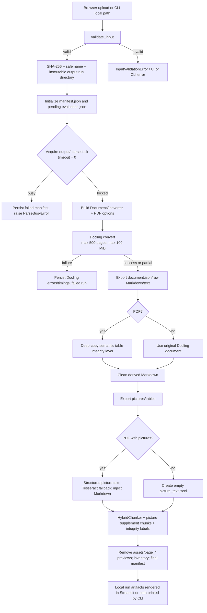

# Decidian Docling Lab — Current Implementation Report

**Scope and evidence.** This report describes the repository as inspected on 14 July 2026: the Python source under `src/decidian_docling`, its tests, Docker configuration, repository documentation, and actual generated runs under `output/`. It distinguishes implemented behavior from the separate *planned* Decidian product architecture. The working tree also contains uncommitted changes to `parser.py`, `postprocess.py`, `ui.py`, `cli.py`, plus a new `semantic_integrity.py`; this report describes that current working-tree implementation because it is what runs locally.

> **Follow-up implementation update — 14 July 2026.** The visual pipeline was subsequently refined. Any conflicting statement below is superseded by this update: (1) a DOCX without page provenance is shown as **Pages: Unavailable**, rather than `0`; (2) fallback Tesseract text must now pass a multi-word/repetition/residue quality filter before being retained; and (3) `chunks.jsonl` is now the core text/table feed only. Accepted visual OCR and visual warnings are emitted separately in `picture_chunks.jsonl`, and their independent readiness/findings are stored in `visual_integrity.json` / `manifest.visual_readiness`. Low-trust or uncovered pictures therefore do not make a structurally clean core feed `review_required`.

## 1. Executive summary

This repository is not yet the full Decidian application. It is a **local, Docker-first Docling evaluation harness** for measuring document parsing quality before any production storage, queue, database, API service, embedding system, or LLM-based decision extraction is added.

The runnable product has two front doors:

- a Streamlit browser UI for one uploaded local document; and
- a Typer CLI for one local file or a sequential local-directory batch.

Both invoke `parse_document()` in `src/decidian_docling/parser.py`. That function validates the file, creates an immutable run directory, serializes Docling conversion through a non-blocking file lock, creates a configured `DocumentConverter`, converts the file, exports raw and derived artifacts, records diagnostics, and returns a small in-process `RunResult`. There is **no HTTP parsing endpoint** and no backend API response payload in the current codebase.

Docling 2.110.0 is pinned. PDFs use a deliberately explicit `PdfPipelineOptions` profile: OCR on, accurate table structure with cell matching, heading hierarchy, parsed/page/picture images at 2× scale, and no remote services/plugins/descriptions/formula/code enrichment. The `scanned` profile only adds forced full-page OCR; `visual` only adds local picture classification and chart extraction.

The most important output distinction is:

| Artifact | What it is | Is it native Docling output? |
|---|---|---|
| `document.json` | Serialized Docling document graph, including provenance, cells and image references | Yes (lossless JSON export) |
| `document.raw.md` | Docling Markdown after four HTML-entity substitutions | Almost; not byte-for-byte native |
| `document.txt` | `document.export_to_text()` from the original conversion document | Yes, Docling export |
| `document.md` | Review/LLM-facing Markdown after semantic and text transformations, plus PDF picture-text insertion | No, application-derived |
| `tables/*.csv`, `tables/*.html` | DataFrames exported from the semantic shadow document for PDFs, original document otherwise | Derived Docling item export; potentially application-repaired |
| `chunks.jsonl` | HybridChunker chunks plus optional picture-text chunks, provenance and integrity labels | Application-generated using Docling chunking |
| `picture_text.jsonl` | Structured picture child text or Tesseract fallback results | Application-generated |
| `semantic_integrity.json` | Audit findings and LLM-readiness gate | Application-generated |

## 2. Codebase map and architecture

### 2.1 Repository layout

```text
Decidian/
├── Dockerfile                         # runtime and test images
├── compose.yaml                       # Streamlit and CLI containers; mounted local volumes
├── pyproject.toml / uv.lock            # pinned Python dependency graph
├── README.md                           # operation and artifact documentation
├── Document/
│   ├── PROJECT_GUIDE.md                # lab goals/evaluation rules
│   ├── Decidian_Architecture_v2.md     # future production design, not runtime code
│   ├── Artifact_Mode_Implementation_Report.md
│   └── Docling_Current_Implementation_Report.md  # this report
├── src/decidian_docling/
│   ├── ui.py                           # Streamlit upload/review UI
│   ├── cli.py                          # `decidian-docling` commands
│   ├── parser.py                       # orchestration, Docling invocation, exports
│   ├── validation.py                   # content/type/size validation and hashing
│   ├── profiles.py                     # Docling PDF pipeline profiles/options
│   ├── postprocess.py                  # Markdown/table/picture-text transformations
│   ├── semantic_integrity.py            # conservative PDF table integrity layer
│   ├── chunking.py                     # Docling HybridChunker serialization and limits
│   ├── artifacts.py                    # JSON, inventory, evaluation, ZIP helpers
│   └── models.py                       # dataclasses, enums, user-facing exceptions
├── tests/                              # unit tests and opt-in real Docling integration tests
├── input/                              # host-mounted CLI input location
├── output/                             # immutable parse runs
└── work/                               # short-lived UI upload files and local exploratory material
```

### 2.2 Runtime components and responsibilities

| Component | Implemented responsibility | Interaction |
|---|---|---|
| Streamlit UI (`ui.py`) | Browser upload, profile selection, artifact inspection, manual evaluation, in-memory ZIP download | Writes a temporary upload into `work/`, calls Python directly, deletes the temporary file in `finally` |
| Typer CLI (`cli.py`) | `parse` and sequential `batch` commands | Calls the same `parse_document()` function; nonzero exit for validation/harness failure |
| Validation (`validation.py`) | Extension allow-list, size/content checks, safe name and SHA-256 | Runs before a run folder is created |
| Parser (`parser.py`) | Locks conversion, constructs Docling converter, exports all artifacts and manifest | Central integration point |
| Profiles (`profiles.py`) | Maps standard/scanned/visual to `PdfPipelineOptions` | Used only for PDFs in the converter |
| Post-processing (`postprocess.py`) | Markdown cleanup, conservative table repairs, picture text extraction/injection | Runs after conversion/export, not inside Docling |
| Semantic integrity (`semantic_integrity.py`) | Deep-copy-based PDF table safety analysis/repair and chunk warnings | Runs only for PDFs |
| Chunking (`chunking.py`) | Docling `HybridChunker`, provenance serialization, strict 1,200-token enforcement | Runs after all PDF semantic work |
| Artifacts (`artifacts.py`) | JSON-safe persistence, evaluation forms, inventory, transient ZIP | Used by parser/UI |

### 2.3 What is *not* implemented

The `Document/Decidian_Architecture_v2.md` file proposes a future Next.js frontend, Fastify API, PostgreSQL/Drizzle, S3/R2, Redis/BullMQ, Node worker, FastAPI parsing service on GCP, and Claude extraction pipeline. Those are architecture plans only. No corresponding source or dependency exists in this repository. Specifically, the current lab has:

- no Next.js/React frontend (the frontend is Streamlit);
- no FastAPI/Fastify endpoint, API route, authentication, or presigned upload;
- no relational/vector database, ORM, migrations, embeddings, RAG/search, classification, summarization, or LLM call;
- no object storage, background queue, retry scheduler, webhook, or worker fleet; and
- no persistence beyond local output files and a Docker volume for models.

Therefore `chunks.jsonl` is an intended future LLM-ingestion candidate, **not currently sent downstream**.

### 2.4 Deployment/runtime boundary

The Docker image uses `python:3.11-slim-bookworm`, installs `libmagic`, GL libraries, and English Tesseract, then uses pinned `uv` dependencies. It prefetches RapidOCR weights during the root build step. Runtime caches are configured with `HF_HOME`, `TORCH_HOME`, and `DOCLING_CACHE_DIR` under `/models`; Compose persists them in the `docling-models` named volume. The image runs as non-root user `appuser`.

Compose mounts host `input/`, `output/`, and `work/` into `/data/input`, `/data/output`, and `/data/work`; `DECIDIAN_*_DIR` points the app there. The Streamlit process exposes port 8501, declares `--server.maxUploadSize=100`, and Compose limits the service to six CPUs and 24 GB RAM. Conversion itself is serialized in-process per output root, so the lab deliberately processes one document at a time.

## 3. Entry points and end-to-end data flow



### 3.1 Browser path

`ui.py` allows one file at a time and offers all allowed extensions. When the user presses **Parse document**, it creates `work/` as needed and writes the upload to a unique file named `<sanitized-stem>-<uuid><lowercase suffix>`. It calls `parse_document(temp_path, profile, DEFAULT_OUTPUT_DIR)` under a Streamlit spinner. `temp_path.unlink(missing_ok=True)` executes in `finally`, including conversion failure. The original UI-upload byte copy is therefore temporary; the run artifacts deliberately remain.

The UI does not upload documents to a network service. After a successful call it stores the Python `RunResult` only in Streamlit session state. It shows the manifest, rendered cleaned Markdown, a text preview of JSON, chunk metadata, table CSVs/repair images, picture PNGs and evaluation controls. It can zip the already-generated run in memory with `BytesIO`; it does not write `result.zip` to disk.

### 3.2 CLI path

The installed script `decidian-docling` maps to `cli:app`.

```powershell
decidian-docling parse <file> --profile standard --output output
decidian-docling batch <directory> --profile scanned --output output
```

`batch` considers only immediate files whose suffix is in the allow-list; it sorts them and processes them sequentially. It continues after per-file failure, counts failures, and exits 1 if any failed. It does not recurse and does not parallelize.

## 4. Input support, validation, storage, and cleanup

### 4.1 Supported inputs

The validation layer accepts these extensions:

| Input family | Extensions | Converter format |
|---|---|---|
| PDF | `.pdf` | `InputFormat.PDF` |
| Word | `.docx` | `InputFormat.DOCX` |
| PowerPoint | `.pptx` | `InputFormat.PPTX` |
| Markdown/text | `.md`, `.markdown`, `.txt` | `InputFormat.MD` (see caveat below) |
| HTML | `.html`, `.htm` | `InputFormat.HTML` |
| Image | `.png`, `.jpg`, `.jpeg`, `.tif`, `.tiff`, `.bmp`, `.webp` | `InputFormat.IMAGE` |

**Caveat verified from code:** `.txt` is validated and offered in the UI, but the converter allow-list contains `MD`, not an explicit `TXT` member. Whether the installed Docling version treats a `.txt` path as Markdown is not demonstrated by an integration test in this repository, so successful conversion of `.txt` cannot be claimed from the code alone. PDF and DOCX are explicitly acceptance-tested; PPTX, HTML, Markdown and images are not covered by real conversion tests here.

### 4.2 Validation rules

`validate_input()` resolves the path and then enforces the following order:

1. The path must exist and be a regular file.
2. The suffix must be in the exact allow-list.
3. The file must be non-empty.
4. Size must be at most `100 * 1024 * 1024` bytes (100 MiB; UI describes this as 100 MB).
5. MIME is detected with `python-magic`; if that import or OS call fails, a small magic-signature detector checks PDF, PNG, JPEG, TIFF, BMP, WebP and ZIP, then UTF-8 text.
6. Content must agree with the claimed extension:
   - PDF must be `application/pdf`.
   - DOCX/PPTX must be a readable ZIP with `word/` or `ppt/` entries respectively, and a recognized Office/ZIP MIME type.
   - MD/Markdown/TXT must decode as UTF-8 and contain no NUL.
   - HTML must have HTML/plain/XHTML MIME and valid UTF-8 non-NUL text.
   - image extensions must have an `image/*` MIME.
7. It calculates a SHA-256 hash in 1 MiB blocks and returns `ValidatedInput` with resolved path, sanitized 80-character stem, hash, byte count, lower-case extension and detected MIME.

The name sanitizer removes path-like/unsafe characters and collapses separators; it is used for output folder and temporary upload names. The code does not impose an upload count quota, authentication policy, antivirus scanning, password/encryption handling, or ZIP decompression-size limit beyond the Office structural inspection.

### 4.3 Run storage and lifecycle

After validation, each invocation creates a unique directory:

```text
<output-root>/<safe-stem>__<first-8-SHA256>__<UTC timestamp>/
```

`mkdir(..., exist_ok=False)` prevents a collision from overwriting an earlier run. The parser creates `manifest.json` with `running` status and `evaluation.json` with pending scores *before* attempting the shared lock. The original CLI source stays where it was; browser source is removed after the call. There is no automatic retention/expiry process for `output/`, no deletion of retained artifacts, and no deduplication that avoids reprocessing identical hashes.

The only cleanup in a successful run removes `assets/page_*` files after exports/chunking. Those are Docling-generated page previews. Embedded-picture assets (`assets/image_*`) are retained because Markdown links and picture evidence use them. Empty `pictures/`, `tables/`, and evidence directories may or may not exist depending on item export/repair conditions.

## 5. Docling integration in detail

### 5.1 Dependencies and initialization

`pyproject.toml` pins `docling==2.110.0`; the lockfile resolves Docling Core and model packages. The Docker environment has CPU-only Torch and RapidOCR prefetching. `parser.py` imports Docling lazily inside `parse_document()`, allowing lightweight unit tests without model initialization.

The central construction is equivalent to:

```python
converter = DocumentConverter(
    allowed_formats=[PDF, DOCX, PPTX, MD, HTML, IMAGE],
    format_options={PDF: PdfFormatOption(pipeline_options=build_pdf_pipeline_options(settings))},
)
result = converter.convert(
    source.path,
    raises_on_error=False,
    max_num_pages=500,
    max_file_size=100 * 1024 * 1024,
)
```

No custom conversion pipeline class, explicit model download call, VLM, remote enrichment, plugin, or retry loop exists. The parser temporarily sets Docling global `settings.debug.profile_pipeline_timings = True`, restores its prior value in `finally`, and serializes `conversion_result.timings` when Docling supplies them.

### 5.2 PDF profiles and exact effective settings

All three profiles inherit the `ProfileSettings` defaults below; only listed deltas change.

| Option | Standard | Scanned delta | Visual delta | Effect |
|---|---:|---:|---:|---|
| `do_ocr` | true | — | — | Enable Docling automatic OCR |
| `OcrAutoOptions.force_full_page_ocr` | false | **true** | false | Scanned PDFs force full-page OCR |
| `do_table_structure` | true | — | — | Run table structure extraction |
| table mode | `accurate` | — | — | `TableFormerMode("accurate")` |
| cell matching | true | — | — | Match extracted text to table cells |
| heading hierarchy | true | — | — | bookmarks, numbering and style enabled; maximum level 6 |
| parsed/page/picture images | true / true / true | — | — | Build required visual artifacts |
| image scale | 2.0 | — | — | 2× images |
| picture classification | false | false | **true** | local visual classification |
| chart extraction | false | false | **true** | local chart extraction |
| picture description | false | false | false | no generated picture descriptions |
| code/formula enrichment | false / false | — | — | disabled |
| remote services/plugins | false / false | — | — | disabled |

These explicit options are supplied only for `InputFormat.PDF`. The current code does not configure equivalent OCR/table settings for DOCX, PPTX, Markdown, HTML or images. It also does not choose a named OCR engine in Python: it uses `OcrAutoOptions`. The manifest calls this “RapidOCR on the CPU image,” and the Docker image prefetches RapidOCR assets, but the exact engine resolution remains Docling/runtime behavior rather than an explicit `engine_type` assignment in source.

### 5.3 Conversion status, limits, logging and errors

Docling receives `raises_on_error=False`, so conversion yields a result even when it records errors. The parser records `status`, serialized `errors`, native `timings`, and `confidence` into the manifest. A `ConversionStatus.FAILURE` yields a failed run without regular document artifacts. A non-failure result produces artifacts; `PARTIAL_SUCCESS` becomes local `partial_success`, otherwise `success`.

Harness-level exceptions are caught, appended as `{category: "harness_exception", type, message}` in `manifest.conversion.errors`, and produce `failed`. The parser does **not re-raise** that general exception to its caller; it returns a failed `RunResult`. Input errors and lock-busy errors occur before/around the main block and are surfaced as `HarnessError` to UI/CLI.

There are no automatic retries, exponential backoff, cancellation token, per-conversion wall-clock timeout, task queue, or structured logging framework. Timing is persisted instead: each application stage has `ran`, duration in seconds, and possibly `failed`; intentionally omitted exports carry `skipped_reason`. A single non-blocking `FileLock(<output-root>/.parse.lock)` prevents simultaneous conversions sharing that output root. Lock contention immediately creates a failed diagnostic run and raises `ParseBusyError`.

## 6. Native Docling result and raw artifacts

### 6.1 In-memory result

The conversion result is a Docling `ConversionResult`, consumed as `conversion_result.document`, `status`, `errors`, `timings`, and `confidence`. The application does not persist the Python object directly. Its initial document is the source of:

- JSON via `document.save_as_json(..., artifacts_dir=Path("assets"), image_mode=ImageRefMode.REFERENCED)`;
- Markdown via `document.save_as_markdown(...same asset options...)`;
- plain text via `document.export_to_text()`; and
- item iteration / images / CSV / HTML / chunks (with the PDF semantic shadow document described later).

The referenced image mode means JSON/Markdown point at relative `assets/...` image files rather than embedding image bytes in JSON.

### 6.2 `document.json`: the authoritative exported structure

This is the closest persisted representation to native Docling output. It is written **before** semantic repairs and never rewritten. A real 48-page PDF run had these top-level keys:

```json
{
  "schema_name": "...", "version": "...", "name": "...",
  "origin": {"mimetype": "application/pdf", "binary_hash": "...", "filename": "..."},
  "furniture": {"...": "..."},
  "body": {"self_ref": "#/body", "children": [{"$ref": "#/texts/0"}], "...": "..."},
  "groups": [], "texts": [], "pictures": [], "tables": [],
  "key_value_items": [], "form_items": [], "pages": {}
}
```

The exact optional content varies by document and Docling version; the code does not define a custom JSON schema. In the inspected PDF:

| Collection | Important fields actually present | Meaning |
|---|---|---|
| `pages["N"]` | `size`, `image`, `page_no` | source page geometry and referenced raster image metadata |
| `texts[]` | `self_ref`, `parent`, `children`, `content_layer`, `label`, `prov`, `orig`, `text`, `level` | typed text items, hierarchy and location |
| `pictures[]` | common item refs/label/provenance, `captions`, `references`, `footnotes`, `image`, `annotations` | detected visual regions and child text links/assets |
| `tables[]` | common item fields plus `data` and `annotations` | table identity, provenance and cell structure |
| `table.data` | `table_cells`, `num_rows`, `num_cols`, `orientation`, `grid` | reconstructed table geometry/content |
| `table_cells[]` | `bbox`, spans, row/column offsets, `text`, `column_header`, `row_header`, `row_section`, `fillable` | individual cell text, layout and semantic flags |

`self_ref` strings (for example `#/texts/247` and `#/tables/6`) are the join keys later retained in chunk provenance. `prov` is a list of provenance objects. The inspected PDF includes `page_no`, a bounding box (`l`, `t`, `r`, `b`, `coord_origin`) and, for text, `charspan`. Thus page and box data are available at item/cell level in the native JSON. The app does not calculate or persist OCR word confidence values; `conversion_result.confidence` is merely copied to the manifest and the inspected DOCX run had null scores.

Representative, abbreviated native text item:

```json
{
  "self_ref": "#/texts/0",
  "parent": {"$ref": "#/body"},
  "label": "section_header",
  "prov": [{"page_no": 1, "bbox": {"l": 140.749, "t": 704.221, "r": 475.895, "b": 690.223, "coord_origin": "BOTTOMLEFT"}, "charspan": [0, 41]}],
  "orig": "Software Requirements Specification (SRS)",
  "text": "Software Requirements Specification (SRS)",
  "level": 1
}
```

### 6.3 Markdown/text distinctions

`document.raw.md` starts as Docling’s `save_as_markdown` export with referenced assets. Immediately after writing it, the app applies only `normalize_markdown_export()`, replacing `&amp;`, `&lt;`, `&gt;`, and `&nbsp;`. It therefore contains unescaped common entities but no heading/table/picture repair. It should not be called an exact byte-level native export.

`document.txt` is independently generated from the **original** Docling document. It does not receive Markdown cleanup, semantic shadow repairs, injected visual text, or integrity warnings. `document.md` is the final human/LLM-facing Markdown and differs materially; see section 7.

### 6.4 Native assets and exported items

The JSON/Markdown export generates `assets/` image files. `_export_items()` then iterates the selected document’s `iterate_items()`:

- every item increments `elements`;
- each `PictureItem` is exported using `get_image(document)` as `pictures/picture-0001.png`, etc.;
- each `TableItem` is converted to a DataFrame and written as `tables/table-0001.csv` and `.html`.

Image/table failures are nonfatal warnings. Normal table PNGs are intentionally *not* written. PNG evidence is written only for tables involved in a Markdown continued-table repair or semantic-integrity finding.

## 7. Post-processing: exact execution order and behavior

The pipeline deliberately preserves `document.json` as native ground truth. It applies transformations to a **deep copy** for certain PDF-derived exports and to Markdown/chunk files. The effective order for a successful conversion is:

1. Export native JSON.
2. Export and entity-normalize baseline raw Markdown.
3. For PDFs only, deep-copy and semantically analyze/repair tables; regenerate a temporary Markdown from the copy.
4. Run Markdown cleanup: heading cleanup → native table continuation merge → one-letter header repair → special borderless-table repair.
5. Persist `document.md` and `semantic_integrity.json`.
6. Export plain text from the original document.
7. Export pictures/tables from the semantic copy for PDFs (or original document otherwise); export relevant evidence images.
8. For PDFs with one or more exported pictures, extract structured picture-region text or run Tesseract fallback; write JSONL and inject it into `document.md`.
9. Chunk the semantic document; append picture supplement chunks; apply integrity annotations/warnings; write `chunks.jsonl`.
10. Remove `assets/page_*` previews, inventory artifacts, complete manifest.

Individual cleanup stages catch their own unexpected exception, add a warning, and leave their input unchanged. This is fail-open cleanup, not a source-document mutation.

### 7.1 PDF semantic integrity layer (`semantic_integrity.py`)

This runs only when the validated source suffix is `.pdf`. It performs `copy.deepcopy(document)`, reads snapshots from the already-written native `document.json`, and mutates only the copy. Consequently:

- `document.json` remains raw native evidence;
- regenerated `document.md`, PDF table CSV/HTML and normal Docling chunks are based on the copy; and
- `document.txt` is still based on the original document.

Each table snapshot derives page/bounding-box, dimensions, reconstructed cell rows, header-row flags, credible-header status, synthetic numeric-header indication and column x-edges. The layer is conservative:

| Condition | Decision/action |
|---|---|
| A credible Docling-marked header contains exactly a one-letter lowercase wrap suffix, e.g. `Threshol d` | Join it in the copy; mark `repaired_high_confidence` if mutation succeeded |
| Adjacent body tables are on consecutive pages, directly adjacent except page furniture, end/start at page boundaries, compatible columns, first has credible headers and second lacks them | Insert inherited header into second copy; record finding |
| Such fragments have matching credible headers | Record `verified`; merge only an explicitly split row |
| Explicit split: right first cell blank, or left first cell ends `_`, `-`, `/`, or `\` | Merge each cell and remove the right fragment row in the copy |
| Boundary geometry/column count conflicts | Do not infer semantics; `review_required` |
| No credible header and synthetic numeric/positional headers | Do not invent headers; `review_required` |

The report contains findings with IDs such as `si-0001`, category/status/message/rationale, table indexes/numbers, `source_table_refs`, page list, affected artifacts, provenance scope, an LLM warning, and a block flag. A 48-page observed PDF contained 24 `review_required` findings—mostly `ambiguous_table_boundary`—and was marked `llm_readiness: review_required`; it did not silently merge those tables.

If the integrity layer itself fails, it returns the original document and records a blocking `preserved` finding. If temporary semantic Markdown generation fails later, the parser keeps baseline Markdown and writes a `review_required` regeneration-exception finding. Both modes make the parse available for inspection rather than silently discarding it.

### 7.2 Markdown cleanup (`postprocess.py`)

`clean_markdown_for_llm()` always runs these four steps in this exact order:

1. **Entity normalization.** The same four common entities are decoded.
2. **Heading cleanup.** It builds context from native JSON: Docling section-header levels, code item first lines, page header/footer text, and repeated section-header text near page boundaries. It removes furniture headings; uses Docling hierarchy when available; makes numeric headings consistent (`1` → H2, `1.2` → H3, capped at H6); splits fused numbered headings; de-promotes dates, long sentence-like headings and selected field labels (`width`, `depth`, `range`, `claim`, `status`, `date`) when marked/list-like; protects fenced code; and escapes a `#` line only when it exactly matches the beginning of a Docling `code` item. This avoids treating a source-code comment as a Markdown heading.
3. **Native Markdown continued-table repair.** It parses pipe tables outside code fences and proceeds only when the count matches native JSON tables, headers have at least 0.95 normalized similarity, tables occur one or two pages apart at opposite page edges, and a row has an explicit continuation marker/blank first right cell. It merges matching cells, suppresses the duplicate fragment, records repair metadata and warning. If counts differ, it skips rather than guessing.
4. **One-letter table-header repair.** A regex accepts only `([A-Z][A-Za-z]{3,})\s+([a-z])`, so `Threshol d` becomes `Threshold`; it deliberately does not alter `Model A`, numeric suffixes or multiword labels. Repairs are counted in the manifest.
5. **Known borderless two-column table repair.** This is an intentionally narrow heuristic, not general table reconstruction. It recognizes only the exact header pairs `Category`/`Requirement` or `Component`/`Specification`, consumes following non-heading/non-table/non-image cells, optionally splits known first-column labels fused with their value, requires at least four even cells, then emits a pipe table. Any other pattern remains unchanged.

The list has five bullets because the first operation occurs inside the function before the four guarded `try` blocks; behavior is exactly as source implements. The resulting Markdown may differ from raw Markdown in headings, table structure and injected visual content, but the source JSON is preserved.

### 7.3 Picture text enrichment and OCR fallback

This supplementary path runs only for **PDFs that have at least one exported `PictureItem`**. It is not the primary full-page OCR mechanism; that is Docling’s configured PDF OCR. The application-level picture path is intended to recover text associated with diagrams/screenshots.

1. It reads `document.json`, maps `texts` by `self_ref`, and matches `pictures[]` to `pictures/picture-*.png` by iteration order.
2. For each picture it creates coverage data from URI, source ref, page, pixel width/height, and a qualification test: area at least 35,000 pixels and shortest dimension at least 50 pixels.
3. It first follows picture child `$ref` values to native text items, discarding page headers/footers/furniture and calculating bounded heading levels. It calls that structured text useful at ≥40 characters, at least four items, or any section-header/code item. Useful structured text wins; no Tesseract is invoked for that picture.
4. Otherwise, qualifying images become fallback candidates. At most 40 are attempted. If Tesseract is absent this becomes a warning; otherwise `tesseract <png> stdout --psm 6 -l eng` runs with a 20-second timeout per image.
5. Tesseract output is whitespace-normalized, discards one-character/no-alphanumeric residue and the common lower-case noise fragments `an`/`oo`, but keeps two-character uppercase labels such as `AI`. Empty/failed/timeout status is kept only in internal coverage/warnings, not as a text record.
6. Records are written to `picture_text.jsonl`. They are injected directly after matching `` Markdown links; unmatched records are placed under `## Extracted Image Text`.

Records originating from Docling child items receive `source: "docling_structured"` and `trust: "medium"`. Fallback records have `source: "tesseract_ocr"` and `trust: "low"`. The Markdown explicitly says both are supporting visual context, not authoritative requirement text. An actual PDF output contained 30 structured/medium records and zero fallback OCR records; its records retained text such as imperfect OCR/reading order (`Browse Inventony`, `Tustomer`), demonstrating why the trust label matters.

`semantic_integrity.py` also defines picture-coverage finding and Markdown-warning helpers (`add_picture_integrity_findings()` and `inject_picture_integrity_warnings()`), but the current parser **does not call either**. It imports/calls `extract_picture_text()`, not `extract_picture_text_with_coverage()`, and only passes the table integrity report to chunk annotation. Thus unresolved application-level picture coverage is not currently represented in `semantic_integrity.json` or injected as an integrity warning. This is verified as an unused implementation path, not an assertion that every picture is covered.

### 7.4 Chunking and integrity annotations

`build_chunks()` uses Docling `HybridChunker` with a Hugging Face tokenizer:

```python
HuggingFaceTokenizer.from_pretrained(
    "sentence-transformers/all-MiniLM-L6-v2",
    max_tokens=1200,
    model_max_length=1_000_000,
)
HybridChunker(
    tokenizer=tokenizer,
    merge_peers=True,
    repeat_table_header=True,
    omit_header_on_overflow=False,
)
```

`HybridChunker` produces document-aware chunks. Each is serialized with raw `text`, `contextualized_text`, headings, captions, unique page numbers, per-item source refs/provenance, and measured contextualized token count. If contextualized content still exceeds 1,200 tokens, the harness performs a lossless whitespace-unit binary-search split, keeps the context prefix/headings where possible, and adds `segment_index` / `segment_count`. The raw source refs remain attached to every split segment. The manifest reports how many original chunks needed this secondary split.

Picture text creates additional chunks with `origin: "picture_text"`, `picture_file`, `asset_uri`, `source`, and `trust`; their context announces source, trust, page and picture. They are appended after normal chunks and all indexes are re-numbered.

Finally, `annotate_chunks_with_integrity()` joins chunk `source_refs[].self_ref` against table finding refs. Every chunk gets `integrity_status` (`verified`, `repaired_high_confidence`, `review_required`, or `preserved`) and `integrity_finding_ids`. A review-required chunk has the semantic warning prefixed to **both** `text` and `contextualized_text`, so an unattended downstream consumer receives the warning rather than only a manifest-level signal.

## 8. Final local artifacts and output schemas

### 8.1 Output layout

```text
output/<safe-name>__<hash8>__<UTC>/
  manifest.json
  evaluation.json
  document.json
  document.raw.md
  document.md
  document.txt
  chunks.jsonl
  picture_text.jsonl
  semantic_integrity.json
  assets/                         # referenced embedded picture assets; page_* removed
  pictures/                       # exported PictureItem PNG evidence
  tables/                         # one CSV/HTML per table; PNG only when needed as evidence
  repaired_table_evidence/        # only native Markdown continued-table repairs
  semantic_integrity_evidence/    # tables for review-required/repaired integrity findings
```

`manifest.json` is the top-level local result descriptor. Its stable application-defined areas include:

```json
{
  "schema_version": "1.0",
  "run_id": "name__hash__timestamp",
  "artifact_mode": "extraction",
  "status": "success | partial_success | failed",
  "source": {"filename": "...", "sha256": "...", "size_bytes": 0, "extension": ".pdf", "detected_mime": "application/pdf"},
  "runtime": {"python": "...", "docling": "2.110.0", "docling_core": "...", "torch": "...", "rapidocr": "..."},
  "profile": {"name": "standard", "do_ocr": true, "...": "..."},
  "conversion": {"status": "success", "errors": [], "timings": {}, "confidence": {}},
  "counts": {"pages": 48, "elements": 571, "tables": 23, "pictures": 30, "chunks": 62},
  "semantic_integrity": {"summary": {}, "finding_count": 24, "artifact": "semantic_integrity.json"},
  "stage_timings": {}, "warnings": [], "artifacts": []
}
```

The inventory is recursive `{path, size_bytes}` entries taken after exports. JSON writing replaces non-finite floats with `null` and uses `default=str`; this matters for diagnostic serialization, not native document semantics.

### 8.2 Chunk and picture-record examples

Representative normal chunk (abbreviated):

```json
{
  "index": 17,
  "text": "Retries must stop after three attempts.",
  "contextualized_text": "Retry policy\nRetries must stop after three attempts.",
  "headings": ["Retry policy"],
  "captions": [],
  "page_numbers": [2, 3],
  "source_refs": [
    {"self_ref": "#/texts/4", "label": "paragraph", "provenance": [{"page_no": 2}]}
  ],
  "token_count": 9,
  "integrity_status": "verified",
  "integrity_finding_ids": []
}
```

Representative structured picture-text record:

```json
{
  "index": 0,
  "picture_file": "picture-0001.png",
  "asset_uri": "assets/image_000000_....png",
  "page_number": 12,
  "width": 869,
  "height": 482,
  "source": "docling_structured",
  "trust": "medium",
  "items": [
    {"self_ref": "#/texts/247", "label": "text", "text": "Add Item", "provenance": [{"page_no": 12, "bbox": {"...": "..."}}]}
  ],
  "text": "Add Item\nBrowse Inventony\n..."
}
```

An equivalent supplemental chunk has `origin: "picture_text"`, preserves its source/trust/asset fields and carries the picture text in `text`/`contextualized_text`. `picture_text.jsonl` is intentionally empty for non-PDFs or PDFs with no pictures; an empty file does not mean an error.

### 8.3 Evaluation and user-visible final result

`evaluation.json` starts as:

```json
{
  "status": "pending",
  "scores": {"reading_order": null, "headings": null, "tables": null, "ocr": null, "images": null, "provenance": null, "chunk_quality": null},
  "total": null,
  "maximum": 14,
  "notes": ""
}
```

The UI only saves a completed evaluation if all seven fields are integer 0, 1 or 2. It then sets `total`, `maximum: 14`, and trimmed notes. This is manual quality metadata; it does not alter Docling output or trigger a downstream workflow.

The direct Python return is `RunResult(run_dir, status, manifest, warnings)`. CLI renders status/path/readiness. Streamlit displays artifacts. There is no JSON HTTP response or database row to describe as the current backend’s final output.

## 9. Downstream use and production-plan boundary

Current downstream consumption ends at local inspection, quality scoring and optional browser download. In particular:

- no embeddings are generated;
- no vector database/search/RAG retrieval exists;
- no classification, candidate extraction, summarization, decision validation/deduplication, or model call is implemented;
- no table/chunk data is persisted outside the run folder; and
- no cloud transfer occurs.

The present intended handoff is `chunks.jsonl` together with the manifest, source hash, source refs/pages and evidence assets. The future architecture document proposes a Node worker to store chunks in PostgreSQL, classify them, send them to an LLM provider, and keep human review provenance. That is useful product context but should not be interpreted as a behavior of this codebase.

## 10. Verification evidence and limits

The test suite verifies validation rules, profiles, serialization, chunk-limit preservation, artifact ZIP/evaluation behavior, Markdown/table/picture helper behavior, and current semantic-integrity behavior. Real Docling integration tests are opt-in (`RUN_DOCLING_INTEGRATION=1`) and generate synthetic text PDF, DOCX and scanned-image PDF; they assert successful/partial successful conversion, expected core files, chunk token counts ≤1,200, PDF table/picture exports and absence of intentionally omitted page/HTML/ZIP outputs.

What cannot be verified from the repository alone:

- successful runtime conversion quality for every listed format (especially TXT, PPTX, HTML, Markdown and each image type);
- the exact internal models selected by Docling/OcrAutoOptions at runtime beyond pinned packages, Docker prefetching and manifest versions;
- complete OCR confidence values—Docling’s confidence object is recorded as emitted and may be null;
- any production database/API/cloud/LLM behavior described in architecture documents; and
- behavior of future features such as the currently uncalled picture-coverage integrity helpers.

## 11. Practical interpretation

For an evaluator, use `document.json` as the unmodified structural/provenance baseline, `document.raw.md` to assess Docling’s Markdown rendering after minimal entity cleanup, `document.md`/`chunks.jsonl` as the application’s proposed LLM-review feed, and `semantic_integrity.json` plus table/picture evidence before trusting repaired or flagged content. A `review_required` manifest/readiness state is intentionally a safety signal: the application preserves the parse but warns that table semantics must not be inferred without evidence review.

For integration work, do not assume that a future consumer can recreate provenance from `document.md` alone. Preserve the run manifest, `chunks.jsonl` source refs, `document.json`, and referenced evidence assets together.
